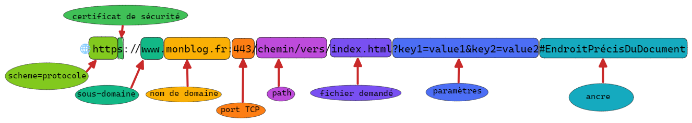
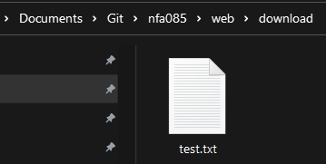

# 1 - Méthodes GET et POST

Le format d'une requête:
```
<Méthode> <URL> HTTP/<version du protocole>
[<champ d'en-tête>: <valeur>]
...
				***saut de ligne***
[corps de la requête]
```

Le format d'une réponse:
```
HTTP/<version><status><commantaire status>
[<champ d'en-tête>: <valeur>]
...
			***saut de ligne***
[corps de la requête]
Document(contenu HTML, XML, image, ...)
```

    

## GET 
### Requête (Request)
```
GET https://www.breiz-brasserie.fr/ HTTP/1.1
Host: www.breiz-brasserie.fr
User-Agent: Mozilla/5.0 (Windows NT 10.0; Win64; x64; rv:109.0) Gecko/20100101 Firefox/110.0
Accept: text/html,application/xhtml+xml,application/xml;q=0.9,image/avif,image/webp,*/*;q=0.8
Accept-Language: fr,fr-FR;q=0.8,en-US;q=0.5,en;q=0.3
Accept-Encoding: gzip, deflate, br
Referer: https://www.google.com/
Connection: keep-alive
Upgrade-Insecure-Requests: 1
Sec-Fetch-Dest: document
Sec-Fetch-Mode: navigate
Sec-Fetch-Site: cross-site
Sec-Fetch-User: ?1
...
```
[obtenu avec le logiciel Fiddler]
* Méthode: GET
* Chemin pour accéder à la ressource: https://www.breiz-brasserie.fr/
* Nom de domaine du site: www.breiz-brasserie.fr
* Version du protocole HTTP: 1.1
* Navigateur: Firefox 110.0 
* Système d'exploitation: WIndows 10.0
* Types de contenu acceptés par le navigateur: (MIME)
    * text/html 
    * application/xhtml+xml
    * application/xml
    * image/avif
    * image/webp
* Langues que le client est capable de comprendre: (priorité selon la valeur de pondération *(q)*:français, français-français, anglais-américain, anglais
* Formats de compression acceptés par le client: gzip, deflate, br
* Adresse de la page Web dont est issue la page actuelle: https://www.google.com/
* Type de connexion: keep-alive ---> créé une connexion persistante
* Le client informe le serveur qu'il peut le rediriger vers une version sécurisée du site.
* Document est le type de données demandé par le client
* La demande concerne la navigation
* Le client et le serveur se trouvent sur des domaines différents 
* C'est l'utilisateur qui est à l'origine de la requête
* Le corps de la requête est vide

### Réponse (Response)
```
HTTP/1.1 200 OK
Date: Sat, 04 Mar 2023 16:37:48 GMT
Server: Apache
Expires: Thu, 19 Nov 1981 08:52:00 GMT
Cache-Control: no-store, no-cache, must-revalidate 
Pragma: no-cache 
Upgrade: h2,h2c
Connection: Keep-Alive
Vary: Accept-Encoding,User-Agent 
Cache-Control: max-age=600, private, must-revalidate 
Content-Length: 15022 
Keep-Alive: timeout=15, max=100
Content-Type: text/html; charset=utf-8

<!doctype html>
<html lang="fr">
...
<head>
    <title>Restaurant Poisson / Fruits de mer Saint-Brieuc - Brasserie Brei'Z</title>
...    
</body>
</html>
```
* Protocole utilisé: HTTP version 1.1
* Requête réussie: code 200
* Message du status: OK
* Type de serveur: Apache
* Possibilité d'utiliser le mécanisme de mise à niveau vers les protocoles **h2** (correspond à HTTP/2 sur TLS) et **h2c** correspond à HTTP/2 sur TCP.
* Connexion persistante
* Le corps de la réponse contient un fichier html

## POST
### Requête
```
POST https://forum.artofmemory.com/ HTTP/1.1
Host: forum.artofmemory.com
User-Agent: Mozilla/5.0 (Windows NT 10.0; Win64; x64; rv:109.0) Gecko/20100101 Firefox/110.0
Accept: */*
Accept-Language: fr,fr-FR;q=0.8,en-US;q=0.5,en;q=0.3
Accept-Encoding: gzip, deflate, br
Content-Type: application/csp-report
Content-Length: 1646
Origin: https://forum.artofmemory.com 
Sec-Fetch-Dest: report 
Sec-Fetch-Mode: no-cors 
Sec-Fetch-Site: same-origin
Connection: keep-alive

{"csp-report":{"blocked-uri":"inline","column-number":1,"disposition":"enforce","document-uri":"https://forum.artofmemory.com/","effective-directive":"script-src-
...
```
Le corps de la requête POST contient des données   
<br>

### Réponse
```
HTTP/1.1 200 OK
Date: Sat, 04 Mar 2023 16:44:40 GMT
Content-Type: application/json; charset=utf-8
Transfer-Encoding: chunked
Connection: keep-alive
vary: Accept-Encoding
Cache-Control: must-revalidate, private, max-age=0
expires: 0
access-control-allow-origin: https://forum.artofmemory.com
access-control-allow-methods: GET, POST
...

[]
```

<br><br><br>


# 2 – Comparaison méthodes

Ce que  l'on peut déduire des exemples:

|     |Méthode| Body     | Action |   
|:---:|:-----:|:--------:|:----------------:|
|Get  | GET | réponse  |demande au serveur l'accès à une ressource |   
|Post | POST| requête  |envoie des données au serveur |   

Ce qu'il y a dans la littérature:

|Propriété   |Get   |Post   |
|---|---|---|
|Type de données   |Caractères ASCII uniquement.   | Caractères ASCII mais également données binaires.  |
|   |   |   |
|   |   |   |
|   |   |   |
|   |   |   |
|   |   |   |
|   |   |   |


# 3 -Extensible

Le protocole HTTP est extensible grâce aux en-têtes de requêtes et de réponses.
En effet, ces en-têtes (headers) rendent évolutif le protocole car il est possible dans créer de nouvelles afin de transmettre dans le flux d'échange, de nouvelles informations.

# 4 - Sans état
HTTP est considéré comme un protocole sans état car chaque requête et réponse est traité de façon indépendante par le serveur qui ne garde pas de trace des informations des requêtes précédentes.
Les conséquences sur la navigation web sont que les serveurs web ne peuvent pas retenir les information de sessions d'une page à l'autre.
Cela confère aux serveurs web des performances accrues car ils peuvent traiter un grand nombre de demandes simultanées.
Pour que les sessions utilisateur soit cohérentes, des mécanismes tels que les cookies sont mis en oeuvre en utilisant les en-têtes.

# 5 – URL


# 6- Codes Status


| Code  |2XX   |3XX   |4XX   |5XX   |
|:---:|:---:|:---:|:---:|:---:|
|Signification   |Succès |Redirection |Erreurs côté client   |Erreurs côté serveur   |
|Exemple|200 Ok|304 la ressource n'a pas été modifiée|403 l'accès à la ressource est interdit|500 erreur interne au serveur   |

# 7 – Négociation de contenu

Une ressource est un terme générique qui peut exprimer une identité, une imprimante...
Ce qui va circuler dans le flux d'échange c'est la représentation de la ressource.
En effet une ressource donnée peut avoir plusieurs représentions.
Une représentation en html va permettre un affichage dans le navigateur.
Une représentation en json va pouvoir être exploitée par un programme afin d'effectuer un traitement.
On peut avoir des  représentations sous  forme d'image en png ou jpeg par exemple.
Le client et le serveur s'échangent des représentations de ressources et la négociation consiste dans le fait que le client et le serveur se mettent d'accord quant au type de représentation échangé.
Le client va indiquer au serveur le type de représentation qu'il est capable de traiter et il va préciser ses préférences.
Le serveur va recevoir la requête et vérifier ce qu'il est capable de réaliser. Il fera au mieux pour satisfaire les préférences du client.
Cela est implémenté dans le protocole grâce à des en-têtes spécialisées
- en-tête client:
    - accept: application /json ---> pour indiquer qu'il souhaite une représentation json de la ressource cible.
    - Accept-Language: fr,fr-FR;q=0.8,en-US;q=0.5,en;q=0.3 (préférence selon une valeur *'q'* de pondération)
    - Accept-Encoding: gzip, deflate, br
- en-tête serveur:
    - Content-Type: text/html; charset=utf-8
    - Content-Type: application/json; charset=utf-8
Nous avons donc une paire d'en-tête client-serveur.


# 8 – Installation Apache & configuration


# 9 – CURL

 Pour chaque requête effectuée, afficher la commande, le résultat et vos commentaires. Requêtes à effectuer en invite de commande, avec curl : 
 
1. Effectuer une requête GET vers l’url http://dev.local 
```
curl http://dev.local
```

2. Afficher l’entête de la réponse pour cette URL 
```
StatusCode        : 200
StatusDescription : OK
```

3. Effectuer une requête GET vers l’url http://dev.local/notExisting 
```
curl http://dev.local/notExisting
```

4. Afficher l’entête de la réponse pour cette URL 
```
curl : Not Found
The requested URL was not found on this server.
```
5. Déposer un fichier localement dans le dossier download depuis la racine de votre virtualhost dev.local


6. Téléchargez le depuis curl
```
curl -O c:\Users\Didier\Documents\Git\nfa085\web\download\test.txt
```
Le fichier test .txt a été téléchargé dans le répertoire de travail.
<br><br>
# 10 – Headers

#### En-têtes de requête
| En-tête  | Description  | Exemple  |
|:---:|:---:|:---:|
|Accept   |Spécifie les types de contenu que le client peut accepter   |`Accept: text/html,application/xhtml+xml,application/xml;q=0.9,image/webp,*/*;q=0.8`   |
|Accept-Encoding   |Spécifie les encodages de contenu que le client peut accepter   |`Accept-Encoding: gzip, deflate`   |
|Accept-Language   |Spécifie les langues de contenu que le client peut accepter   |`Accept-Language: fr, en;q=0.5`   |
|Authorization    | Données d’authentification (par exemple pour un login)   | `Basic WjbU7D25zTAlV2tZ7==`   |
|Cache-Control  |Spécifie les directives de cache à utiliser pour la requête et la réponse    |`Cache-Control: no-cache`   |
|Connection   |Contrôle les options de connexion entre le client et le serveur   |`Connection: keep-alive`   |
|Content-Length   | Spécifie la longueur du corps de la requête en octets  |`Content-Length: 4523`   |
|Content-Type   |Spécifie le type de contenu du corps de la requête   | `Content-Type: application/json`  |
|Cookie   | Transmet les cookies stockés sur le client au serveur  | `Cookie: SID=31d4d96e407aad42`  |
|Date |Date et heure de la demande |`Date: Mon, 9 March 2020 09:02:22 GMT` |
|Expect |Formule une attente au serveur, généralement la réception d’une demande importante. |`Expect: 100-continue (le serveur doit envoyer le code 100 lorsqu’il est prêt à recevoir la requête)`` | 
|Host   |Spécifie le nom de domaine du serveur   | `Host: www.monblog.fr`  |
|If-Match| Exécution conditionnelle d’une action, en fonction de la concordance d’un code transmis|`If-Match: „ft678iujhnjio90’pöl“`|
|If-Modified-Since|Envoyer uniquement si le contenu demandé a été modifié depuis le moment spécifié|`IF-Modified-Since: Mon 2 Mar 2020 1:00:00 GMT`|
|If-None-Match|Comme ci-dessus, mais spécifié via un ETag (Entity-Tag = tag d’entité, voir ci-dessous)|`If-None-Match: „cxdrt5678iujhgbvb“`|
|If-Range|Ne demande que la partie du contenu qui a été modifiée ou qui manque dans le cache du client|If-Range: Mon 2 Mar 2020 1:00:00 GMT|
|If-Unmodified-Since|Analogue à IF-Modified-Since|If-Modified-Since: Mon 2 Mar 2020 1:00:00 GMT|
|Max-Forwards|Définit le nombre maximum de fois que la réponse du serveur peut être transmise|Max-Forwards: 12|
|Proxy-Authorization|Utilisé pour authentifier le client auprès d’un serveur proxy|`Proxy-Authorization: Basic WjbU7D25zTAlV2tZ7==`|
|Range|Précise une partie du contenu demandé|`Range: bytes=0-9999`|
|Referer  |Spécifie l'URL de la page précédente à partir de laquelle la requête a été envoyée   | `Referer: https://www.example.com/page1.html`  |
|TE|Codage de transfert d’extension accepté|`TE: gzip, deflate`|
|User-Agent  |Identifie le client effectuant la requête   | `User-Agent: Mozilla/5.0 (Windows NT 10.0; Win64; x64) AppleWebKit/537.36 (KHTML, like Gecko) Chrome/88.0.4324.146 Safari/537.36`  |

#### En-têtes de réponses
| En-tête  | Description  | Exemple  |
|:---:|:---:|:---:|
|Allow  |Types de demandes autorisées pour une ressource spécifique |`Allow: GET, POST, HEAD`  |
| Cache-Control  | Si l’objet peut être conservé dans le cache et pendant combien de temps  |`Cache-Control: max-age=4800`   |
|Connection   |Type de connexion préféré   |`Connection: close` |
|Content-Encoding   |Type de compression   |`Content-Encoding: deflate`   |
| Content-Language  | Langue de la ressource  |`Content-Language: fr-FR`   |
|Content-Length   | Taille du corps en octets  |`Content-Length: 135674`|
|Content-Location   |Emplacement du fichier s’il provient d’un endroit différent de celui demandé (par exemple CDN)   |`Content-Location: /exemple.fr`   |
|Content-Security-Policy   |Concepts de sécurité du serveur   | `Content-Security-Policy: frame-src ‘none’; object-src ‘none’`  |
|Content-Type   | Type MIME du dossier demandé  |`Content-Type: text/tml; charset=utf-8`   |
|Date   | Délai de réponse  | `Date: Mon 2 Mar 2020 1:00:00 GMT`  |
|ETag   | Marque une version spécifique du fichier  | `ETag: „vt6789oi8uztgfvbn“`  |
| Expires  |Quand le dossier doit être considéré comme obsolète   | `Expires: Tue 3 Mar 2020 1:00:00 GMT`  |
| Last-Modified  |Date de la dernière modification du dossier   | `Last-Modified: Mon 2 Mar 2020 1:00:00 GMT`  |
| Location  |Identifie le lieu où la demande a été transmise   |`Location: https://www.exemple.fr`   |
|Proxy-Authenticate   |Indique si et comment le client doit s’authentifier auprès du proxy   | `Proxy-Authenticate: Basic`  |
| Retry-After  |A partir de quand le client doit faire une nouvelle demande si la ressource est temporairement indisponible (date ou secondes)   | `Retry-After: 300`  |
| Server  |Identification du serveur   |`Server: Apache`   |
|Set-Cookie   |Installe un cookie chez le client   | `Set-Cookie: UserID=XY; Max-Age=3800; Version=1`  |
|Transfer-Encoding   |Méthode de compression   | `Transfer-Encoding: gpzip`  |
|Vary   |Indique quels champs d’en-tête doivent être considérés comme variables si un fichier est demandé dans le cache   |`Vary: User-Agent (= le serveur contient différentes versions de fichiers selon l’User Agent)``   |
| Via  | Via quels proxies la réponse a été envoyée  |  `Via : 1.1www.exemple.fr` |


tag: #NFA085
